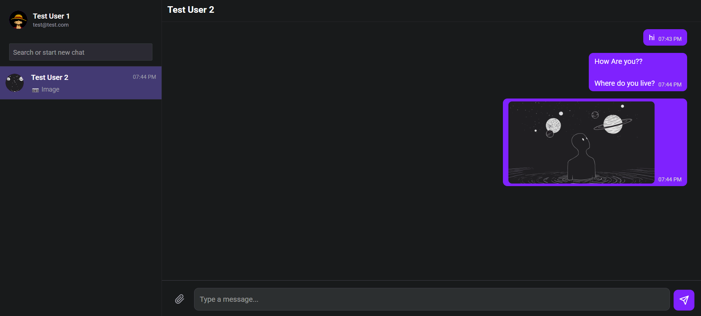
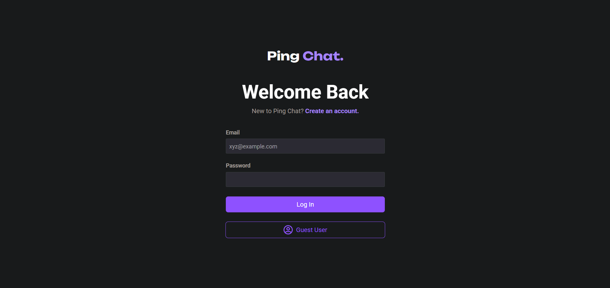
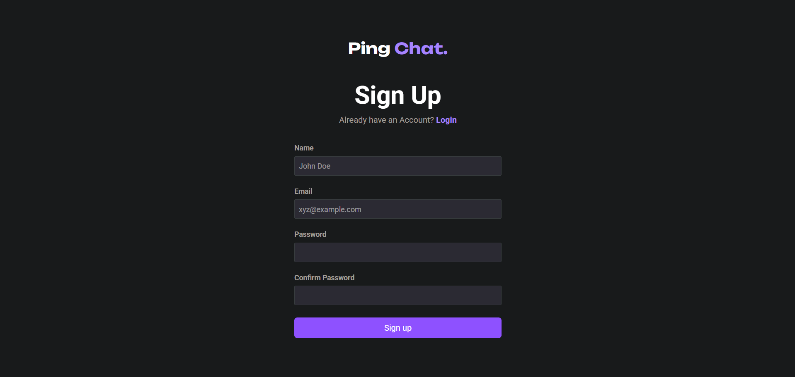
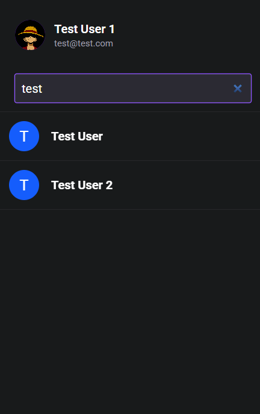
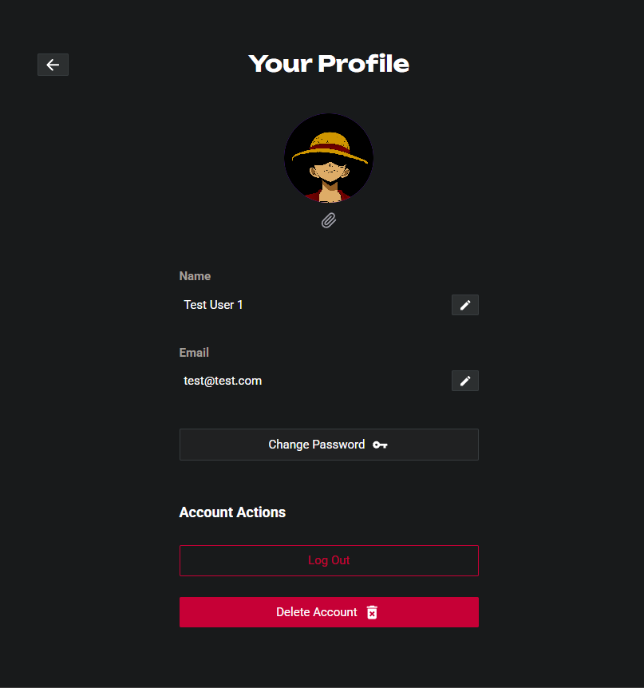

# PingChat - A Real-Time Messaging App (Work in Progress)

A full-stack chat application built with Node.js, Express, React, and MongoDB, featuring live messaging with Socket.IO.

Here's a sneak peek of how it's looking!

[](demo/chatwindow.png)

---

### Tech Stack

#### Frontend
* **React** (For building the user interface with components)
* **React Router** (For handling client-side navigation between pages like `/login`, `/chats`, `/profile`)
* **Tailwind CSS** (For rapid, utility-first styling)
* **Socket.IO Client** (To connect to the server for real-time communication)
* **Axios** (To make HTTP requests to the backend API)

#### Backend
* **Node.js** (The JavaScript runtime environment that runs the server)
* **Express.js** (The web framework used to build your API, routes, and middleware)
* **Socket.IO** (To manage the real-time, live connection for the chat)
* **Mongoose** (To create schemas and interact with the MongoDB database easily)
* **JSON Web Token (JWT)** (For creating secure access tokens for user authentication)
* **Bcrypt.js** (For hashing user passwords securely before saving them)
* **Multer** (The middleware for handling file uploads from the user)
* **Cloudinary** (The cloud service for storing and serving the uploaded images)

## ✨ Features (Currently Under Development)

* **Real-Time Messaging:** Instantly send and receive text and image messages.
* **User Authentication:** Secure signup and login system using JWTs and `HttpOnly` cookies.
* **Find & Chat:** Search for other registered users by name or email to start new conversations.
* **Profile Management:** Update your user profile, including your name, email, password, and avatar.
* **Message Actions:** Send Images and Delete(unsend) your own messages.

**Note:** Hey, this project is a work-in-progress and more features will be added by me. This commit represents the current state of the application.

---

## 🚀 How to Run Locally

Follow these instructions to get the project running on your local machine.

#### **Prerequisites**
* [Node.js](https://nodejs.org/) installed
* [MongoDB](https://www.mongodb.com/) installed and running
* A free [Cloudinary](https://cloudinary.com/) account for image uploads

#### **1. Backend Setup**

First, navigate into the `server` directory.

1.  Install dependencies:
    ```bash
    npm install
    ```
2.  Create a `.env` file by copying `.env.example`. Then, fill in your MongoDB connection string, JWT secret, and Cloudinary credentials.
3.  Start the backend server:
    ```bash
    npm run dev
    ```
    The backend will be running on `http://localhost:5000` (or your specified port).

#### **2. Frontend Setup**

Open a new terminal and navigate to the `client` directory.

1.  Install dependencies:
    ```bash
    npm install
    ```
2.  Create a `.env` file by copying `.env.example`. The API URL should be correctly set for you.
3.  Start the frontend development server:
    ```bash
    npm run dev
    ```
    The application will be available at `http://localhost:5173` (usually).

---

## 👀 A Few Glimpses

[](demo/login.png)
**Login**

[](demo/signup.png)
**Create Account**

[](demo/chatsearch.png)
**Find users or start a new chat**

[](demo/chatwindow.png)
**Live Conversations**

[](demo/profile.png)
**Manage Your Profile**

**Thanks for checking out this work in progress! More improvements are on the way.**